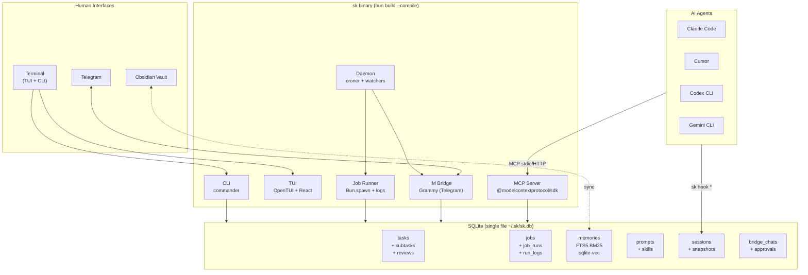
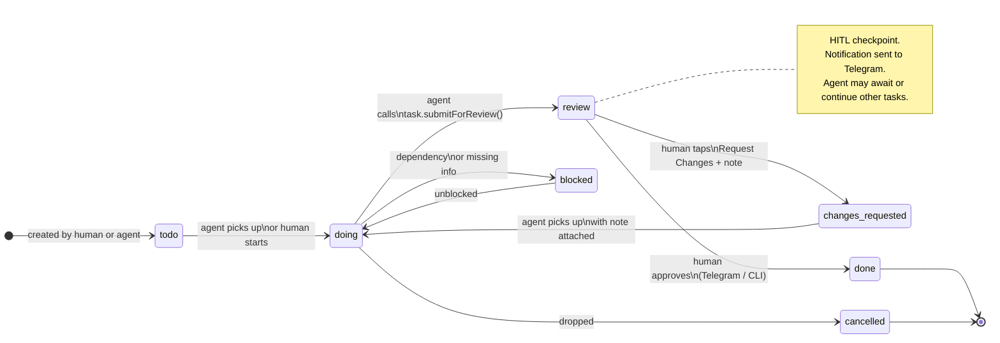
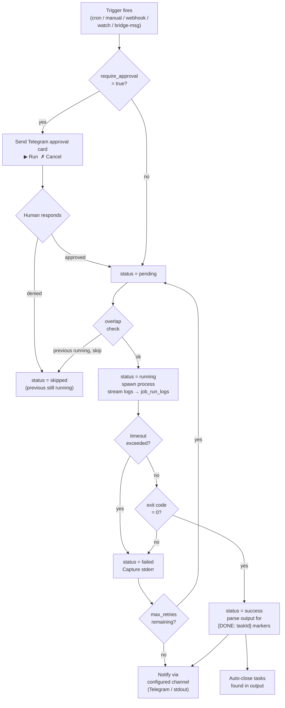
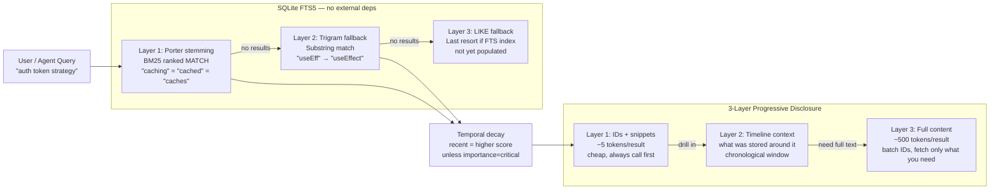
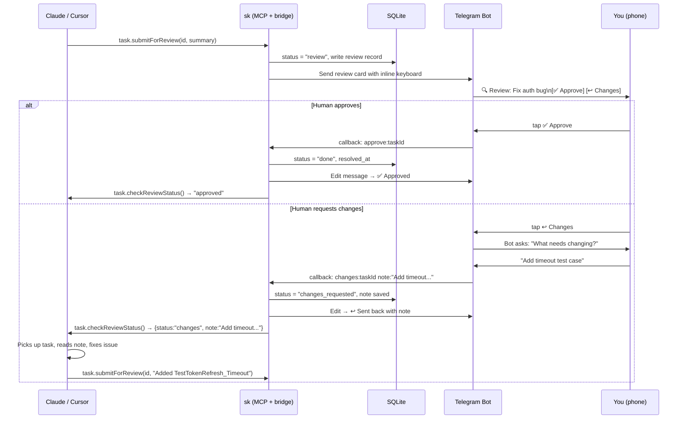
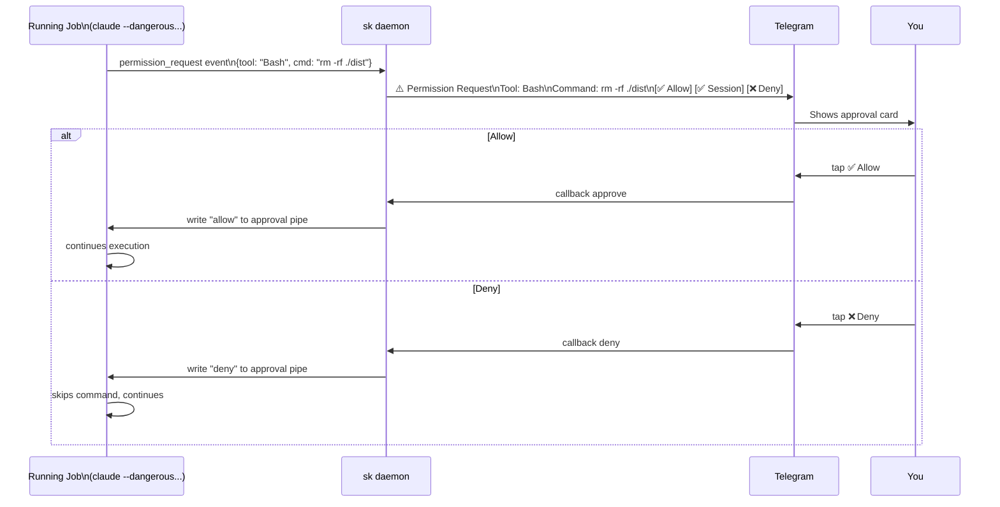
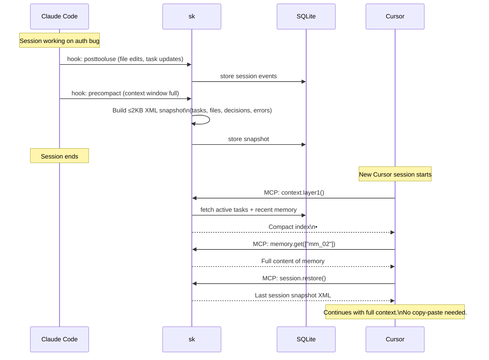
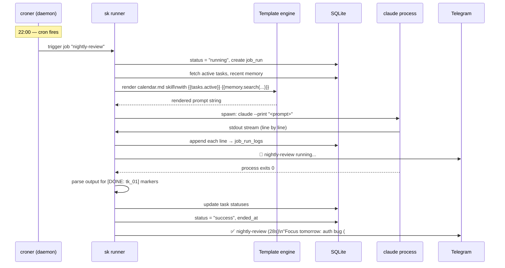

# SIDEKICK

### Local-First Human ↔ AI Collaboration Hub

> One Bun binary. Persistent memory · Task management with HITL review ·
> Generic job runner · Prompt/skill library · Telegram bridge · MCP server.
> The shared brain for Claude Code, Cursor, Codex, Gemini CLI — and you.

---

## System Architecture



---

## Task Lifecycle (HITL State Machine)



---

## Job Execution Flow



---

## Memory Search Pipeline (FTS5 BM25)

> No external embedding deps. SQLite FTS5 with porter stemming gets 98% context savings with zero infra.



---

## Telegram HITL Review Flow



---

## Agent Permission Approval Flow



---

## Multi-Agent Context Handoff



---

## Nightly Review Scheduled Job



---

## OpenTUI Dashboard Layout

```
┌─────────────────────────────────────────────────────────────────────┐
│  sk  [Tasks]  [Jobs]  [Memory]  [Bridge]        ⬡ daemon: running  │
├─────────────────────────────────────────────────────────────────────┤
│                                                                     │
│  TASKS                                           REVIEW QUEUE       │
│  ──────                                          ────────────────   │
│  TODO (3)          DOING (2)    REVIEW (1)       🔍 Fix auth bug    │
│  ┌──────────────┐  ┌──────────┐  ┌──────────┐       by claude      │
│  │ Update README│  │ Auth bug │  │ Auth bug │       3m ago         │
│  │ low · api    │  │ high·api │  │ high·api │   [✅ Done]           │
│  └──────────────┘  └──────────┘  └──────────┘   [↩ Changes]        │
│  ┌──────────────┐  ┌──────────┐                                     │
│  │ Deploy review│  │ Deploy   │                  JOBS               │
│  │ normal · api │  │ normal   │                  ────────────────   │
│  └──────────────┘  └──────────┘                  ● nightly-review  │
│                                                    ✅ 22:01  28s    │
│                                                   ● standup-notify  │
│  MEMORY SEARCH                                     ✅ 09:01  12s    │
│  ──────────────                                   ● sync-vault      │
│  🔍 [auth strategy_____________]                   ❌ 08:45  timeout│
│                                                                     │
│  • "use sync.RWMutex for token refresh" [api]    BRIDGE STATUS      │
│  • "session tokens expire in 1h"        [api]    ─────────────────  │
│  • "auth issue: race on refresh"        [api]    ✅ Telegram active │
│                                                   1 pending review  │
└─────────────────────────────────────────────────────────────────────┘
 [tab] switch panel  [/] search  [n] new  [enter] expand  [q] quit
```

---

## Technology Stack

| Layer             | Choice                    | Why                                                            |
| ----------------- | ------------------------- | -------------------------------------------------------------- |
| **Runtime**       | Bun                       | Single binary via `--compile`, cross-platform, Anthropic-owned |
| **Language**      | TypeScript (strict)       | Same as Claude Code, Codex, Gemini CLI — whole ecosystem       |
| **TUI**           | **OpenTUI + React**       | Native Zig core, powers OpenCode, built-in Code/Diff/ScrollBox |
| **CLI parsing**   | commander                 | Lightweight, typed, battle-tested                              |
| **Database**      | bun:sqlite                | Built into Bun, fastest SQLite binding, zero deps              |
| **ORM / schema**  | Drizzle ORM               | Zero runtime overhead, TS types = schema                       |
| **Cron**          | croner                    | No deps, best TS API, named jobs, pause/resume                 |
| **Telegram**      | Grammy                    | Modern TS-first, conversations plugin for multi-step HITL      |
| **MCP**           | @modelcontextprotocol/sdk | Official Anthropic SDK                                         |
| **IM bridge**     | claude-to-im              | npm install, reuse directly — no rewrite                       |
| **Embeddings**    | @ollama/ollama            | Local-first, no API key, falls back to OpenAI                  |
| **Vector search** | sqlite-vec extension      | Same file as main DB, zero infra                               |
| **Full-text**     | SQLite FTS5 native        | BM25 ranking built in                                          |
| **Process exec**  | Bun.spawn                 | Native, PTY support, streaming stdout/stderr                   |
| **File watching** | chokidar                  | Cross-platform, solid, minimal                                 |
| **Testing**       | bun:test                  | Built in, fast                                                 |

---

## Project Structure

```
sk/
├── src/
│   ├── cli.ts                  ← entry: bun build --compile
│   ├── daemon.ts               ← entry: croner + bridge + watchers
│   │
│   ├── db/
│   │   ├── schema.ts           ← Drizzle schema (source of truth for all types)
│   │   ├── client.ts           ← bun:sqlite + drizzle instance singleton
│   │   └── migrations/
│   │
│   ├── commands/               ← one file per CLI command group
│   │   ├── task.ts
│   │   ├── job.ts
│   │   ├── mem.ts
│   │   ├── prompt.ts
│   │   ├── skills.ts
│   │   ├── context.ts
│   │   ├── bridge.ts
│   │   ├── hook.ts             ← sk hook posttooluse/precompact/sessionstart
│   │   └── obsidian.ts
│   │
│   ├── core/
│   │   ├── runner.ts           ← job executor: Bun.spawn + log streaming
│   │   ├── scheduler.ts        ← croner wrappers + trigger routing
│   │   ├── search/
│   │   │   ├── bm25.ts         ← FTS5 queries
│   │   │   ├── vector.ts       ← sqlite-vec cosine search
│   │   │   └── hybrid.ts       ← RRF fusion
│   │   ├── embed/
│   │   │   ├── ollama.ts
│   │   │   └── openai.ts
│   │   ├── context/
│   │   │   ├── layers.ts       ← 3-layer progressive disclosure
│   │   │   ├── template.ts     ← {{tasks.active}} etc.
│   │   │   └── snapshot.ts     ← ≤2KB precompact XML builder
│   │   └── skills/
│   │       ├── loader.ts       ← scan dirs, parse SKILL.md frontmatter
│   │       └── render.ts       ← template variable substitution
│   │
│   ├── bridge/
│   │   ├── telegram.ts         ← Grammy bot setup + command handlers
│   │   ├── hitl.ts             ← review/approval flows + inline keyboards
│   │   ├── streaming.ts        ← edit-in-place response streaming
│   │   └── router.ts           ← mode: direct / agent:claude / job:<n>
│   │
│   ├── mcp/
│   │   ├── server.ts           ← MCP server (stdio + HTTP)
│   │   └── tools.ts            ← all tool definitions
│   │
│   └── tui/                    ← OpenTUI + React components
│       ├── App.tsx             ← root: tab navigation
│       ├── Dashboard.tsx       ← overview: tasks + jobs + review queue
│       ├── JobMonitor.tsx      ← live status + log tail (Code component)
│       ├── TaskBoard.tsx       ← kanban by status
│       ├── MemBrowser.tsx      ← searchable memory list
│       └── ReviewQueue.tsx     ← pending HITL items
│
├── skills/                     ← built-in starter skills (SKILL.md format)
│   ├── calendar/SKILL.md
│   ├── standup/SKILL.md
│   └── code-review/SKILL.md
│
├── skill/SKILL.md              ← sk itself as a Claude Code / Codex skill
│
├── hooks/                      ← drop-in hook configs for agents
│   ├── claude-code/settings.json
│   ├── gemini-cli/settings.json
│   └── cursor/mcp.json
│
├── build.ts                    ← cross-compile all targets
├── package.json
└── tsconfig.json
```

---

## Build & Distribution

```typescript
// build.ts — produces binaries for all platforms
const targets = [
  { target: "bun-linux-x64", out: "dist/sk-linux-x64" },
  { target: "bun-linux-arm64", out: "dist/sk-linux-arm64" },
  { target: "bun-darwin-arm64", out: "dist/sk-mac-arm64" },
  { target: "bun-darwin-x64", out: "dist/sk-mac-x64" },
  { target: "bun-windows-x64", out: "dist/sk.exe" },
];

for (const { target, out } of targets) {
  await Bun.build({
    entrypoints: ["./src/cli.ts"],
    outfile: out,
    target: target as Parameters<typeof Bun.build>[0]["target"],
    compile: true,
    minify: true,
  });
}
```

**Install options for users:**

```bash
# macOS / Linux (curl install)
curl -fsSL https://get.sidekick.sh | sh

# Homebrew
brew install sidekick/tap/sk

# Manual: download binary from GitHub Releases, chmod +x, move to PATH
```

---

## OpenTUI vs Ink: Why OpenTUI Wins Here

|                  | Ink                | **OpenTUI**                                           |
| ---------------- | ------------------ | ----------------------------------------------------- |
| Core             | Pure JS            | **Native Zig** — faster, lower memory                 |
| Powers           | GitHub CLI, Prisma | **OpenCode** — exact ecosystem match                  |
| Code rendering   | None               | **Built-in tree-sitter** — perfect for job logs       |
| Diff rendering   | None               | **Built-in Diff component** — perfect for HITL review |
| Scroll           | Limited            | **ScrollBox** — handles long job output               |
| React support    | ✅                 | ✅                                                    |
| `bun create tui` | ❌                 | ✅                                                    |
| Maturity         | Stable v5          | v0.1 but production in OpenCode                       |

The `Code` and `Diff` components are what make OpenTUI the right call.
When reviewing a task in the TUI, you want to see the actual diff of what
Claude changed — syntax-highlighted, scrollable — not a wall of text.

---

## Key Design Decisions

| Decision      | Choice                 | Reason                                                      |
| ------------- | ---------------------- | ----------------------------------------------------------- |
| Runtime       | Bun                    | Single binary, Anthropic-owned, whole AI ecosystem is TS    |
| TUI           | OpenTUI + React        | Powers OpenCode, native Zig core, Code/Diff components      |
| Cron          | croner in-process      | Cross-platform, no OS scheduler, named jobs, pause/resume   |
| SQLite        | bun:sqlite + Drizzle   | Built into Bun, typed schema, zero overhead                 |
| Telegram      | Grammy + conversations | Multi-step HITL flows are first-class                       |
| HITL gate     | `review` status        | Explicit holding state, auditable, works for subtasks       |
| MCP           | Official SDK           | Direct Anthropic support, works with all agents             |
| Skills format | Standard SKILL.md      | Compatible with Claude Code, Codex, Gemini CLI              |
| IM bridge     | claude-to-im (reuse)   | Already solves bidirectional bridge, streaming, permissions |
| Context       | 3-layer progressive    | Never dump raw data — agents pull only what they need       |
