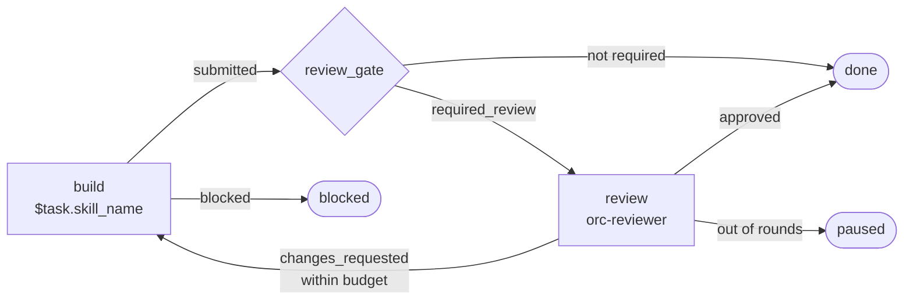
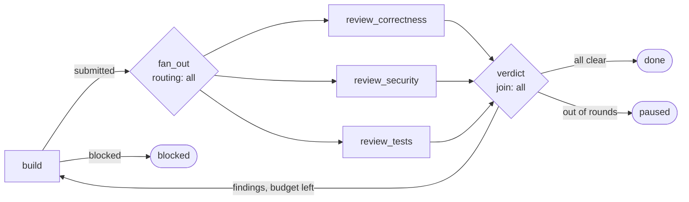

# Task Flows — graphs and loops

> **Status:** Implemented
> **Packages:** `@orc/core` (schema + engine + service), `@orc/runner` (flow runner), `@orc/api`, `@orc/mcp`, `@orc/cli`

## Why

ORC's task loop used to hardcode one shape: a worker runs the task's skill, a reviewer checks it, feedback loops back to the worker, and `max_review_rounds` pauses the task if it cycles too long. Every task got that shape whether it fitted or not, and the only way to change it was to patch `task-loop.ts`.

Real work has other shapes. Plan before building. Fix, then independently confirm the fix holds. Keep an executor working while a supervisor re-verifies its claims from outside its context. Review one change three ways at once and only proceed when all three agree. Wait for a human at a specific point rather than at the end.

A **flow** is that shape, declared as data: nodes joined by conditional edges that may cycle.

## The core split

**The graph is deterministic. Only the nodes are agents.**

- `packages/core/src/flow-engine.ts` is pure. Given a state and a node result it returns the next state plus a list of actions. No DB, no clock (the caller passes `now`), no agents. Loops, fan-out, joins, and every termination rail are unit-testable without spawning a single LLM.
- `packages/runner/src/flow-runner.ts` is the impure half. It applies those actions: spawning sessions, writing the ledger, moving task status, killing cancelled work.

An LLM decides *what happened*. Nothing else. Where that verdict leads is code.

## Anatomy

```jsonc
{
  "name": "my-flow",             // must match its directory name
  "description": "...",
  "version": 1,
  "entry": "build",
  "limits": {
    "max_node_executions": 24,        // total node runs before halting
    "execution_timeout_secs": 14400,  // wall clock for the whole run
    "max_parallel": 4,                // concurrent nodes per task
    "reset_on_revisit": true,         // re-entering a node starts a fresh session
    "halt_task_status": "paused"      // where the task lands when a rail trips
  },
  "nodes": { /* id → node */ },
  "edges": [ /* { from, to, when?, label? } */ ]
}
```

### Nodes

| Field              | Applies to     | Meaning                                                              |
| ------------------ | -------------- | -------------------------------------------------------------------- |
| `kind`             | all            | `agent` \| `gate` \| `human` \| `terminal`                           |
| `skill`            | agent          | Skill name, or `$task.skill_name`                                    |
| `prompt`           | agent, human   | Node-specific instructions appended to the skill                     |
| `backend`, `model` | agent          | Override the backend/model; `$task.agent_backend` etc. also work     |
| `role`             | agent          | `worker` (default) or `reviewer` — sets the session role             |
| `outcomes`         | agent, human   | Declared verdicts. Defaults to whatever the outgoing edges reference  |
| `on_error`         | agent          | Outcome to route on if the node dies. Without it, the run halts       |
| `routing`          | any            | `first` (default, first matching edge wins) or `all` (fan out)        |
| `join`             | any            | `{ mode: "all" \| "any", from: [...], cancel_siblings? }`             |
| `max_visits`       | any            | Hard cap on how many times this node may run                          |
| `reset_on_revisit` | agent          | Per-node override of the run default                                  |
| `task_status`      | any            | Status to set when the node starts (or, for a terminal, ends in)      |
| `vars`             | any            | Merged into run vars **on entry** — this is how a loopback resets state |

`gate` nodes run nothing and route immediately: use them for deterministic branching, fan-out points, and joins. `human` nodes wait for `orc flow resume`. `terminal` nodes end the run and decide the task's final status.

### Edges and conditions

Edges are evaluated **in order** and the first match wins (unless the node sets `routing: "all"`, which activates every match). The bounded-loop idiom is therefore a guarded loopback followed by a catch-all escalation:

```jsonc
{ "from": "verify", "to": "done",  "when": { "outcome": "pass" } },
{ "from": "verify", "to": "build", "when": { "all": [
    { "outcome": "fail" },
    { "visits": { "node": "build", "lt": { "var": "max_review_rounds" } } }
]}},
{ "from": "verify", "to": "escalated", "when": { "always": true } }
```

Conditions are **data, never code** — a definition is JSON that a user or an agent authored, so it must not be able to execute anything. There is no `eval`, no expression language. Every condition object is *strict*: an unknown key is rejected rather than stripped, because a silently stripped key is what turns a guarded loopback into an unguarded one.

| Condition      | Example                                                       |
| -------------- | ------------------------------------------------------------- |
| `always`       | `{ "always": true }`                                          |
| `outcome`      | `{ "outcome": "fail" }` or `{ "outcome": ["fail", "error"] }`  |
| `visits`       | `{ "visits": { "node": "build", "lt": 4 } }` (omit `node` = self) |
| `executions`   | `{ "executions": { "gte": 10 } }`                             |
| `elapsed_secs` | `{ "elapsed_secs": { "gt": 3600 } }`                          |
| `var`          | `{ "var": "tests_ok", "eq": true }`, also `ne`/`lt`/`gte`/`contains`/`exists` |
| `all`/`any`/`not` | `{ "all": [ ..., ... ] }`                                  |

Numeric comparators take a number **or** `{ "var": "name" }`. That indirection is what lets a shipped flow say "loop while under the task's own budget" instead of baking in a constant.

Three layers keep a mistyped guard from quietly becoming an unconditional edge:

- an unknown key (`lessThan` where `lt` was meant) is **rejected**, not stripped;
- a `var` with no predicate at all is **rejected**, since it would match whenever it was evaluated;
- a `visits: { node: … }` naming a node that does not exist is **rejected**, since a missing node reads as 0 visits and would always satisfy an `lt` guard.

What remains is the *resolvable* case: a `{ var }` operand whose var is absent or non-numeric at runtime makes the comparison **false** — fail closed, so an unresolvable budget shortens a loop rather than unbounding it.

Definitions are bounded in shape too — nesting depth, value count, node and edge counts, prompt length, and each `limits` field all have caps — and parsing is total: `parseFlowDefinition` returns errors and never throws, so one unusable definition cannot abort the loop cycle for every other task.

### Run vars

Injected at start: `task_id`, `task_title`, `project_id`, `skill_name`, `required_review`, `max_review_rounds`. Nodes extend them via `flow_report(vars: …)`, and a node's own `vars` are merged when it is entered. Non-reserved vars are rendered into node prompts, which is how a supervisor's `directive` reaches the executor.

## Fan-out and joins

`routing: "all"` on a node activates every matching edge, so several nodes run concurrently:

```jsonc
"fan_out": { "kind": "gate", "routing": "all" },
"verdict":  { "kind": "gate", "join": { "mode": "all", "from": ["a", "b", "c"] } }
```

- `mode: "all"` waits for every listed source. `mode: "any"` fires on the first arrival and, by default, cancels its siblings — that is the race/first-answer-wins pattern.
- Arrival state resets once a join fires, so joins work correctly inside loops. Arrivals are also stamped with their source's visit count, so a branch that loops back *past* a join cannot leave an arrival behind that satisfies it on the next round.
- Fan-**in** to a node that is not a join is refused (`concurrent_reentry`): two copies of one node cannot be told apart by a reporting agent, so a join is the construct for converging branches.
- Fan-out never exceeds capacity. Extra nodes sit as `pending` rows and drain as worker slots free up, honouring `agent_loop.max_workers`, the project's `max_workers`, and the flow's `max_parallel`. A single-worker install runs the branches one after another instead of failing.
- Reaching **any** terminal ends the whole run and cancels branches still in flight.

Fan-out costs roughly N× the tokens. Use it where one reviewer demonstrably misses things, not by default — and note that with the default `agent_loop.max_workers` of 1 the branches run one after another, so you pay the tokens without gaining wall-clock. Raise `max_workers` before reaching for `orc-parallel-review`.

## Termination

A flow cannot loop forever. Five independent rails, each halting the run and (by default) pausing the task with a comment naming what tripped:

1. `max_visits` per node
2. `limits.max_node_executions` for the run
3. `limits.execution_timeout_secs` wall clock — also swept from outside the graph, so a run whose nodes all hang is still caught
4. no matching edge after an outcome → `no_matching_edge`
5. nothing left to run → `stalled`, or `join_deadlock` when branches are parked at a join that can no longer be satisfied

Plus: a node that dies routes through `on_error` if it declares one, otherwise the run halts with the error attached. A node that ends without reporting anything halts with `no_outcome` rather than the graph guessing a verdict. Mutually-routing gates trip a chain limit instead of spinning.

`describeHalt()` turns each reason into a sentence for the task comment and `orc flow status`.

## The node contract

A node reports its verdict with the `flow_report` MCP tool:

```
flow_report(task: "<id>", node: "verify", outcome: "fail",
            summary: "auth check missing on the delete path",
            vars: { tests_ok: false })
```

The node's prompt is assembled from its skill plus **exactly the outcomes its outgoing edges can route**, so the agent is told which verdicts are legal rather than inventing one the graph cannot use. Anything else is rejected with the valid list.

The node's prompt lists exactly the outcomes its outgoing edges can route, and anything else is rejected — with one honest exception: a node whose only outgoing edge is a catch-all has no derivable outcome list, so it accepts whatever it is given.

**Fallback inference.** Skills written against the old protocol drive the task status instead of the flow. If a node's session ends without a report, the outcome is inferred from the status the agent left behind:

| Task status         | Candidate outcomes (first routable wins)                   |
| ------------------- | ---------------------------------------------------------- |
| `blocked`           | `blocked`                                                  |
| `review`            | `submitted`, `reviewed`, `milestone`, `ready`              |
| `done`              | `approved`, `pass`, `verified`, `complete`, `submitted`     |
| `changes_requested` | `changes_requested`, `fail`, `reject`                      |
| `cancelled`         | `blocked`                                                  |

If nothing matches and the node has exactly one declared outcome, that one is used. Otherwise the run halts for a human — an ambiguous guess is worse than a pause.

## The ledger

`flow_node_runs` holds one row per node visit: which node, which attempt, its outcome, its summary, its session, its error. Gates and terminals are recorded too, so the row sequence is the actual path taken.

This is the durable-communication idea from the octopus-skill loop-graph pattern: nodes talk to each other through an inspectable record, not by inheriting each other's context. Each node's prompt includes the ledger so far, which means a supervisor can audit an executor's claims while starting from a clean session.

## Where flows live

| Source    | Location                             | Notes                                                    |
| --------- | ------------------------------------ | -------------------------------------------------------- |
| `builtin` | `packages/core/src/flows/builtin.ts` | Compiled in — the published package ships only `dist/index.js`, so a filesystem-only default flow would leave npm installs with nothing to run |
| `user`    | `~/.orc/flows/<name>/flow.json`      | Shadows a builtin of the same name — which `flow_create` requires you to ask for explicitly, since shadowing `orc-default` re-pipelines every task |
| `project` | `./.orc/flows/<name>/flow.json`      | Shadows user and builtin                                 |
| `task`    | `tasks.flow_override` (JSON column)  | An inline graph for one task; beats all of the above     |

Precedence mirrors config loading. Shadowing by name is how you customise `orc-default` without patching orc.

Definitions are validated on load — unknown edge targets, unreachable nodes, terminals with outgoing edges, a graph with no reachable terminal, a join whose source cannot reach it, an agent node with nothing to do, and edges shadowed by an earlier catch-all are all rejected. An invalid flow is **reported** by `flow_list` and the API, not silently skipped.

A run **freezes its definition** at start (`flow_runs.definition`), so editing a flow file never changes the shape of a run already in flight.

## Built-in flows

### `orc-default`

Reproduces the pipeline the task loop used to hardcode, so migrating changed no behaviour.



`max_review_rounds` is honoured as a run var, so the task field keeps working with no special-casing in the engine.

### `orc-parallel-review`

Fan-out and join, exercising the concurrent path.



Each reviewer sets its own `*_ok` var; the verdict gate routes on all three. `build` clears those vars on entry so a loopback cannot inherit last round's passes.

### The rest

| Flow                    | Shape                                                                        |
| ----------------------- | ---------------------------------------------------------------------------- |
| `orc-review-only`       | One review pass, for a task a human moved straight to `review`               |
| `orc-plan-build-verify` | planner → coder → reviewer, looping until the acceptance criteria pass. The planner can report `insufficient_context` rather than inventing requirements |
| `orc-fix-verify`        | bugfix → independent confirmation the fix holds and a regression test exists |
| `orc-supervisor`        | Executor keeps its session across rounds (`reset_on_revisit: false`); supervisor always gets a fresh one (`true`) so it cannot inherit the executor's blind spots |

## Authoring

```bash
orc flow list                                     # what exists, plus anything invalid
orc flow show orc-plan-build-verify               # nodes, edges, limits
orc flow validate --file ./my-graph.json          # check before running anything
orc flow create   --file ./my-graph.json          # save reusable, to ~/.orc/flows/
orc flow attach <taskId> --file ./my-graph.json --start   # bespoke, this task only
orc flow attach <taskId> --name orc-supervisor
orc flow status <taskId>                          # active nodes + ledger
orc flow resume <taskId> --outcome approved       # resolve a human node
orc flow halt   <taskId>                          # stop it, kill live nodes
```

Agents use `flow_list`, `flow_read`, `flow_create`, `flow_attach` (pass `definition` for an inline graph), `flow_status`, and `flow_report`. A planner that has just decomposed a task can author the graph for it.

### Authoring checklist

- Every non-terminal node needs at least one outgoing edge, and a **catch-all last** unless every outcome is explicitly routed. Otherwise an unexpected verdict halts the run.
- Put the guarded loopback **before** the escalation edge — first match wins.
- Give every loop a bound: `max_visits`, or a `visits` guard on the loopback edge, or both. Whichever you use is shown to the node in its prompt, so a reviewer on its last allowed round knows a rejection escalates.
- Declare a `task_status` on agent nodes. A node without one falls back to its role's natural status (`doing`, or `review` for a reviewer), but saying so is clearer than relying on that.
- Declare `on_error` on any node whose failure has a sensible route. Without it, a crash halts the whole run.
- Reset stale vars with `vars` on the node the loop returns to.
- Name outcomes for what happened (`fail`, `blocked`), not for where they go (`go_to_build`) — the edges own the routing.

## HITL

Human gates are first-class rather than bolted on:

- A `human` node parks the run, sets the task status, and posts a comment saying exactly how to resolve it.
- `orc flow resume <task> --outcome <x>` (or `POST /tasks/{id}/flow/resume`, or `flow_report`) continues the graph.
- A human moving the task **out of band** always wins, whatever the nodes are doing. Authority is decided by *who* made the change, not by what the graph is up to: a change authored by a human stops the run (or, if a gate is waiting and can route the verdict, answers it), while one authored by an agent or by the flow itself is the normal in-flow protocol and is left alone. Guessing from node status meant a human closing a task whose node was merely queued got silently ignored — and an agent was then spawned on work they had closed.
- `done`, `cancelled`, `changes_requested`, `blocked` and `paused` all reach the flow, not just the three that end a task.
- **A human gate does not burn the execution timeout.** Time a run spends `awaiting_human` is excluded from `execution_timeout_secs`, and the timeout sweep skips a run parked on a person. Otherwise the wall clock would be a fuse on every gate — four hours on orc-default's defaults — and the halt would cancel the node the human was about to answer.
- Only a `human` node pages a human. Agent reviewer nodes also move a task to `review`, and notifying on those meant one task sent "ready for review" once per review round, each time asking for an approval the flow would immediately override.

## In the web dashboard

`packages/web` reads flows through the same API the CLI and MCP use — it adds no flow state of its own.

- **Task detail → Flow.** `GET /tasks/{id}/flow` gives the frozen definition plus the ordered ledger, and the panel draws both: the graph with the active node highlighted, the visit count and budget on each node, and one ledger row per visit carrying its verdict, summary, error, session link and timings. A halted run shows `halt_reason` with `describeHalt()`'s sentence. Clicking a node lists the edges leaving it, in routing order, with each condition rendered as prose.
- **The graph is drawn, not laid out by a library** (`src/lib/flow-graph.ts`): a deterministic left-to-right layering with loopbacks classified as back edges and routed under the boxes, because "this edge goes backwards" is the thing a flow picture has to show and is exactly what a generic DAG layout hides. Flows are at most 128 nodes, so the layout stays a pure, unit-tested function with no dependency.
- **Human gates are resolvable from the UI.** The offered outcomes are derived from the waiting node's outgoing edges — the same derivation `declaredOutcomes()` does server-side — so the menu is whatever the graph can actually route. A node with only a catch-all edge has no derivable list, and the form asks for a free-text outcome instead, matching the API, which accepts any outcome there. Submitting posts the comment and calls `POST /tasks/{id}/flow/resume`; `POST /tasks/{id}/flow/halt` sits behind a confirmation, since it kills live sessions.
- **Flows browser** (`/flows`) lists every flow with its source, marks the one a task with no `flow_name` will run, flags a flow that shadows another of the same name, and renders the `broken[]` array from `GET /flows` with its validation errors — an invalid flow is visible before a task tries to run it.
- **Flow picker** on task create and edit writes `flow_name` (clearing it falls back to the default). A task carrying an inline `flow_override` says so instead of offering a name, because the override wins.
- **`queued` reads as pending, not in progress.** The board maps it into Todo and the dashboard counts it with todo, because the runner sets `queued` while a node waits for a worker slot. Cards whose real status differs from their column say which status they are in.

The web UI needed two additions to the API, both additive: `GET /flows` returns `default_flow` (the configured `agent_loop.default_flow`, without which "which flow will this task run" is unanswerable from outside the server), and each ledger row carries `created_at` (a queued or human-parked node has no `started_at`, so it is the only clock for how long it has been waiting — the same `COALESCE` the runner uses).

## Schema

```
flow_runs
  id, task_id, project_id, flow_name, flow_source, definition (frozen snapshot),
  status (running|completed|halted|cancelled), active, visits, joins, vars,
  node_executions, paused_secs, halt_reason, started_at, ended_at

flow_node_runs
  id, flow_run_id, task_id, node_id, node_kind, attempt, retry,
  status (pending|running|awaiting_human|succeeded|failed|cancelled|skipped),
  outcome, summary, error, skill_name, gateway_session_id, resume_session,
  created_at, started_at, ended_at
  UNIQUE (flow_run_id, node_id, attempt, retry)

tasks
  + flow_name TEXT
  + flow_override TEXT (JSON)
```

`status = completed` means the graph reached a terminal — including an escalation terminal that pauses the task. `status = halted` means a rail tripped. The two are worth distinguishing when reading a run: one is a designed outcome, the other is the safety net.

Node rows are keyed `(flow_run_id, node_id, attempt, retry)`: `attempt` is the graph visit, `retry` distinguishes sessions within one visit. Finished runs are pruned with the rest of the history (`pruneHistory`, 30 days by default); `running` ones are kept whatever their age.

For debugging, `GET /tasks/{id}/flow` and `orc flow status` carry each node's `gateway_session_id`, which is the route from a suspicious verdict to the agent's actual transcript, plus per-node timings and any error text.

## Prior art

- [Strands `graph_loops`](https://strandsagents.com/docs/examples/python/graph_loops_example/) — cycles via conditional edges, with `max_node_executions`, execution timeouts, and reset-on-revisit as explicit safety rails.
- [Graph engineering with Claude Code](https://www.aibuilderclub.com/blog/graph-engineering-with-claude-code) — nodes / edges / shared state; each node must be a loop that ships on its own; graphs cost real tokens, so they are opt-in.
- [AI-native development specifications](https://alexeyondata.substack.com/p/ai-native-development-specifications) — PM → Engineer → QA with binary verdicts and conditional loopback; acceptance criteria are what the verifier judges against.
- [octopus-skill](https://github.com/levi-qiao/octopus-skill) — an executor plus an independent supervisor that re-verifies from clean context, communicating through a durable, inspectable ledger rather than shared context.
